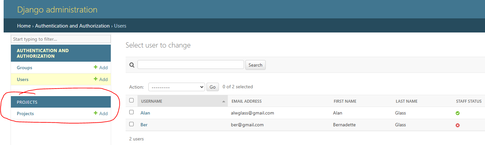

MVT Design  -   Model View Template

DJANGO GITHUB REPO --  https://github.com/django/django/blob/main/django/contrib/auth/views.py

Web Framework -  Backend
node.js - Express - Language / Framework
python - Django - Language / Framework
python - Flask - Language / Framework

Other Framework - Cherry Pie -

Django -  Easy to build API - REST API

MVT Design

DJANGO  - ADMIN
check
compilemessages
createcachetable
dbshell
diffsettings
dumpdata
flush
inspectdb
loaddata
makemessages
makemigrations
migrate
optimizemigration
runserver
sendtestemail
shell
showmigrations
sqlflush
sqlmigrate
sqlsequencereset
squashmigrations
startapp
startproject
test
testserver

INSTRUCTIONS TO START A PROJECT

django-admin startproject devsearch

    ----->>> Creates the Boiler Plate Files For a Project
        ---> a Project can contain Many Apps
            --> Inner And Outer Folders

settings.py - >  Config  -  SQL DBs etc
ups.py - > routing
    HttpResponse -  can reposnt template , json etc

    def homePage(request):
    return HttpResponse('Hello World')

urlpatterns = [
    path('admin/', admin.site.urls),
    path('', homePage)   #   --->>>> first paramater is the route , http://127.0.0.1:8000/<ROUTE>
                         #   --->>>> second parameter is the function to call When That Route is entered  - e.g. function homePage above
]

Projects And Apps

$ python manage.py startapp = -->> Creates the new app boiler plate folders

CRATE THE PROJECTS APP   <<<<<  InSIDE THE MAin Project     >>>>>
    Add a urls.py File inside the app

    add The relates url patterns
        e.g. create a projects "app" Folder
             create The view.py file to contain All the functions related to projects

                from django.http import HttpResponse
                    # Create your views here.

                    def projects(request):
                        return HttpResponse('Here are our Projects!!')

                    def project(request ,pk):
                        return HttpResponse('SINGLE PROJECTS!!' + ' ' + str(pk))

            create a urls.py File to coatain the related route urlpatterns  <<< BE SURe O IMPORT THE RELATED VIEWS FILE>>>

                from . import views

                    urlpatterns = [
                        path('projects/', views.projects ,  name = "projects"),
                        path('project/<str:pk>', views.project ,  name = "project"),  #### --->>> add <str:pk> the url parameter and To the def function above
                        
                    ]

URLS

using the <a> to pass in The link to Construct The URL for the project   
          using below approach -  if the "projects changes then if the url checnged it has to change every place its used
          to address this in DJANGO you should use the name parameter in urls.py
 <li> Title: <a href = "/project/{{project.id}}" > {{project.title}} </a> </li>  

below 'project' refers To the name in the url.py and project.id is the arg
<li> Title: <a href = "" > {{project.title}} </a> </li>

ADMIN

create super user  - python manage.py createsuperuser

DB Models

$ python manage.py makemigrations
Migrations for 'projects':
  projects\migrations\0001_initial.py
    - Create model Project

$ python manage.py migrate
Operations to perform:
  Apply all migrations: admin, auth, contenttypes, projects, sessions
Running migrations:
  Applying projects.0001_initial... OK

GOTO: projects/admin.py   -->>> 
add ---->   "from .models import Project"

add ---->   "admin.site.register(Project)"

https://drawsql.app/

ONE TO ONE

    -->> for Table Extensions   ----->>>  One User Can Have One Portfolio

ONE To MANY

    -->> One Profile can have Many Projects

Many to MAny
    -->> Example  -  tags in Projects
    -->> Use Intermediary table
   

QUERIES SQL in DJANGO

QUERY EXAMPLES

ModelName.object.filter(attribute = 'value')

    .fiter(attribute__)

--->>> PYTHON SQL SHELL  

python manage.py shell

EXAMPLE COMMANDS-- 

In [1]: from projects.models import Project

In [2]: projects=Projects.objects.all()

In [3]: projects=Project.objects.all()

In [4]: print(projects)
            RETURNS    --->>>   <QuerySet [<Project: Portfolio Manager>, <Project: Music Website>, <Project: Recipe Finder>, <Project: Personal Portfolio>]>

projectObj =  Project.objects.get(title= "Portfolio Manager")

In [5]: projectObj =  Project.objects.get(title= "Portfolio Manager")

In [6]: print(projectObj)
Portfolio Manager

In [7]: print(projectObj.id)
174ec358-14df-4b88-be8d-dbf2c7d6bdf7

In [9]: projects = Project.objects.filter(title__startswith="P")

In [10]: print(projects)
<QuerySet [<Project: Portfolio Manager>, <Project: Personal Portfolio>]>

In [11]: projects = Project.objects.filter(vote_ratio__lte=50)   ---->> lte  =  less then or equal to example

In [12]: print(projects)
<QuerySet [<Project: Recipe Finder>]>

In [15]: print(projectObj.review_set.all())   - - > One to many 
---- >>>>>>>>  query  Object.CHILD OBJECT (must be lower case) _set.all()  - Gives all entries from the Review Table relates to the main Object 
<QuerySet [<Review: up>, <Review: up>, <Review: down>]>

Many to Many

In [16]: print(projectObj.tags.all())   --->>> tags is the mode (in lower case)
<QuerySet [<Tag: SQL>, <Tag: Python>, <Tag: Bootstrap>, <Tag: JavaScript>, <Tag: HTML>, <Tag: CSS>, <Tag: Flask>]>

manage.py commands

python manage.py startapp <app_name>
python manage.py collectstatic    ---->>> collect Static for Production and move to "staticfiles" Folder
python manage.py makemigrations   ---->>> stage DBMS changes
python manage.py migrate          ---->>> migrate and DB staged shanges

Adding An App  - - - - - -
    python manage.py startapp <app_name>     --->>>  Adds All Django App folders

    Update  PROJECT settings.py
        INSTALLED_APPS = []
            *** 
            add 'projects.apps.ProjectConfig'  -->> Example  <"<app_name>".apps.<app_name>Config >

        CREATE
            templates Folder in <app> folder
                create <app_name> folder in <templates> Folder  --->>> 
                        <project>
                            <app>
                                <templates>
                                    <app_name>
                                        [html files]

        CREATE
            urls.py in <app_name> folder
                in urls.py 
                    from django.urls import path
                    from . import views
        
        IN MAIN urls.py

        CREATE Models related to the App

        REGISTER The MODELS in ADMIN
            <app_name>/admin.py
                from.models import Profile
                # Register your models here.

                admin.site.register(Profile)

SIGNALS

AUTHENTICATION v AUTHORISATION

CLASS VIEWS

Import the Model and the django buitl in views.generic ListView and DetailView

List View Gets all model date
Details view gets single details

from . models import Post
from django.views.generic import ListView ,  DetailView

class PostListView(ListView):
    model = Post
    template_name = 'blog/home.html'
    context_object_name = 'posts'
    ordering = ['-date_posted']   ### "-" sign is descending order

SESSION CREATED in LOGIN

EMAIL SETUP FOR APP PASSWORDS

https://support.google.com/accounts/answer/185833?hl=en

DJANGO FILTER
import django-filter

https://github.com/django/django/blob/main/django/contrib/auth/views.py

RESTful API

https://www.django-rest-framework.org/

JSON WEB TOKENS  - https://jwt.io/

https://django-rest-framework-simplejwt.readthedocs.io/en/latest/getting_started.html#installation

https://jwt.io/#debugger-io

POSTMAN -  TEST OF API

permissions  : 

CORS - - Cross-Origin Resource Sharing

When accessing The Same end point from seperate servers

DJANGO Docs  -  https://pypi.org/project/django-cors-headers/

 -   after CORS enabled 

 

 FOR JS  - in Dev Tools  -  Local Storage can be accessed localstorage.getitem() for ket value pairs

 

 https://www.digitalocean.com/community/tutorials/build-a-to-do-application-using-django-and-react